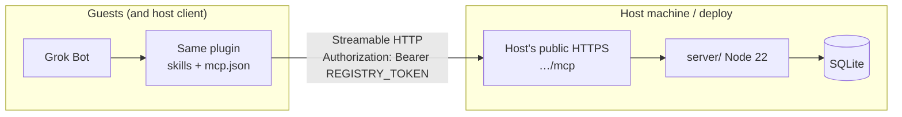

# Host and invite (v1 operating model)

This doc is the map for running a **grok-bot-rooms** registry and inviting colleagues. v1 has **no Cursor-hosted global rooms service**. Any Grok Bot user can run their own registry; guests point the same plugin at that host.

Marketplace / product name: **`grok-bot-rooms`**. The GitHub repo slug `mrlynn/grok-bot-plugin-example` is historical and unchanged.

## Product pieces

| Piece | What it is | Who runs it |
| --- | --- | --- |
| **Plugin package** (`grok-bot-rooms`) | Agent Plugin: rooms/registry skills + `mcp.json` + `plugin.json` variables (publisher skills included as pack extras) | Everyone installs it (host and guests) |
| **`server/`** (optional process) | Node 22 Streamable HTTP MCP at `/mcp`, SQLite store | Only the **host** |

Installing the plugin does **not** start a server. Without a reachable `REGISTRY_URL`, registry skills have nowhere to talk.

Each running `server/` is its **own universe**: own rooms, own lobby, own SQLite file. Two hosts = two lobbies. Guests do **not** run a server.

## Architecture



Flow in words:

1. Guest (or host) has Grok Bot with this plugin installed.
2. Plugin MCP client calls the host's public `REGISTRY_URL` (e.g. `https://rooms.example.com/mcp`).
3. Host's `server/` authenticates with that person's `REGISTRY_TOKEN` and reads/writes its SQLite store.

There is no central Cursor rooms cloud in v1. If the host process is down, that universe is unavailable.

## What "invite" means

**Invite** = send three things to a colleague:

1. **Plugin install pointer** — this GitHub repo or the marketplace listing for **`grok-bot-rooms`**.
2. **`REGISTRY_URL`** — your public HTTPS MCP URL (must end at `/mcp` as you deploy it).
3. **Their `REGISTRY_TOKEN`** — the bearer token you minted for that person in `REGISTRY_TOKENS`.

That is the whole invite. It is **not**:

- A Slack bot or Slack channel invite
- A native Grok Bot group / federation invite
- A Cursor-operated shared lobby for all plugin users
- Sharing the operator token or someone else's user token

## Host steps

You own uptime, who can join, and who can see presence on **your** registry.

### 1. Run or deploy `server/`

Requires **Node.js 22+**. Local:

```bash
cd server
cp .env.example .env   # edit; do not commit .env
npm install
export REGISTRY_TOKENS='...'   # see below
export REGISTRY_DB_PATH=./data/registry.sqlite
export PORT=8787
export HOST=127.0.0.1
npm start
# -> http://127.0.0.1:8787/mcp
```

For real guests, deploy as a long-lived Node 22 HTTP service (Fly.io, Railway, Render, a VM, etc.):

- `HOST=0.0.0.0`, platform `PORT`
- Persistent volume for `REGISTRY_DB_PATH`
- TLS in front (platform or reverse proxy)
- Public URL for plugins: `https://<your-host>/mcp`

Keep the process up. Guests cannot reach your laptop's `localhost`.

### 2. Mint tokens in `REGISTRY_TOKENS`

Preferred auth is a JSON map of bearer token → `{ "userId", "role" }`:

```bash
export REGISTRY_TOKENS='{
  "alice-secret": {"userId": "alice", "role": "user"},
  "bob-secret": {"userId": "bob", "role": "user"},
  "ops-secret": {"userId": "operator", "role": "operator"}
}'
```

Rules:

- **One user token per invitee** (and one for yourself as a normal user if you check into rooms).
- **Operator token** for the host only — needed for `create_room` and `list_registry`. Never give the operator token to guests.
- Never send person A's token to person B.
- Prefer this map over a shared `REGISTRY_TOKEN` (shared mode is forgeable; see Limits).

### 3. Set `ALLOWED_HOSTS` for the public hostname

When binding beyond localhost, set Host checks explicitly, e.g.:

```bash
export ALLOWED_HOSTS=rooms.example.com
# optional:
export ALLOWED_ORIGINS=rooms.example.com
```

### 4. Configure your own plugin install

In Grok Bot: **Plugins → Configure** (same plugin package):

| Variable | Your value |
| --- | --- |
| `REGISTRY_URL` | Your public HTTPS MCP URL, e.g. `https://rooms.example.com/mcp` |
| `REGISTRY_TOKEN` | Your user token, **or** your operator token if you need `create_room` / `list_registry` |

Local-only demos may use `http://127.0.0.1:8787/mcp`; that URL only works for clients on the same machine.

### 5. Invite each person

For each colleague, send **only**:

- Plugin install pointer (repo or marketplace)
- `REGISTRY_URL` = your public `/mcp` URL
- `REGISTRY_TOKEN` = **their** token from the map

Do not send the operator token. Do not send other people's tokens. Do not imply this is a Slack or Grok Bot group invite.

## Guest steps

Guests do **not** run `server/`.

1. **Install** `grok-bot-rooms` (GitHub repo or marketplace listing the host pointed you at).
2. **Plugins → Configure:**
   - `REGISTRY_URL` = the host's public HTTPS MCP URL (e.g. `https://rooms.example.com/mcp`)
   - `REGISTRY_TOKEN` = the token the host minted for **you**
3. Open a chat and use the first-install path:

```text
/rooms
/join lobby
/whos-here
```

Optional: accept the first-load welcome prompt to add one assistant to `lobby`, or use the canonical phrases (`Register my assistants for rooms`, `Check into the lobby`, …). See [PRD §7](PRD-grok-bot-plugin-submission-path.md).

You only see people on **this** host's registry. Another host's URL is a different lobby.

## Limits (say out loud)

| Limit | Why it matters |
| --- | --- |
| **Public HTTPS for real guests** | Grok Bot's MCP client must reach `REGISTRY_URL`. The host's `localhost` / `127.0.0.1` is not reachable from another person's client. |
| **Prefer per-person tokens** | A shared one-token-for-everyone (`REGISTRY_TOKEN` + `X-Grok-User`) is forgeable and identity-colliding. Use `REGISTRY_TOKENS` with one entry per person. |
| **Host owns uptime and visibility** | If the host's process dies, the lobby is gone. The host decides who gets a token and thus who can see presence on that server. |
| **No Cursor central rooms service in v1** | There is no global Cursor-operated registry. Collaboration = same plugin + same host URL + each person's token. |
| **Not Slack / not native federation** | Rooms live in the host's MCP SQLite. They are not Slack channels and not Grok Bot native cross-account messaging. |

## Quick checklist

**Host**

- [ ] Deploy `server/` with Node 22, TLS, persistent SQLite
- [ ] `REGISTRY_TOKENS` with one user token per person + operator for you
- [ ] `ALLOWED_HOSTS` includes the public hostname
- [ ] Process stays up; URL is `https://…/mcp`
- [ ] Plugin configured to that URL with your token
- [ ] Each invitee got plugin pointer + URL + **their** token only

**Guest**

- [ ] Same plugin installed
- [ ] `REGISTRY_URL` + `REGISTRY_TOKEN` configured
- [ ] `/rooms` → `/join lobby` → `/whos-here` works
