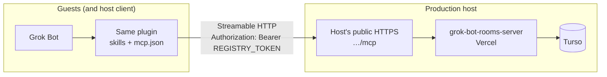

# Host and invite (v1 operating model)

This doc is the map for running a **grok-bot-rooms** registry and inviting colleagues. v1 has **no Cursor-hosted global rooms service**. Any Grok Bot user can host a registry; guests point the same plugin at that host.

Marketplace / product name: **`grok-bot-rooms`**. The plugin GitHub repo slug [`mrlynn/grok-bot-plugin-example`](https://github.com/mrlynn/grok-bot-plugin-example) is historical and unchanged. The production registry lives in a **separate** repo: [`mrlynn/grok-bot-rooms-server`](https://github.com/mrlynn/grok-bot-rooms-server).

## Product pieces

| Piece | What it is | Who runs it |
| --- | --- | --- |
| **Plugin package** (`grok-bot-rooms`) | Agent Plugin: rooms/registry skills + `mcp.json` + `plugin.json` variables (publisher skills included as pack extras). This repo. | Everyone installs it (host and guests) |
| **Production registry** ([`grok-bot-rooms-server`](https://github.com/mrlynn/grok-bot-rooms-server)) | Hosted MCP at `/mcp` (public PoC: **Vercel + Turso**) | Only the **host** |
| **`server/` in the plugin repo** | **Local / dev** copy: Node 22 Streamable HTTP `/mcp`, SQLite | Optional laptop demos / smoke tests |

Installing the plugin does **not** start a server. Without a reachable `REGISTRY_URL`, registry skills have nowhere to talk.

Each running registry is its **own universe**: own rooms, own lobby, own DB. Two hosts = two lobbies. Guests do **not** run a server.

The plugin contract stays the same wherever you host: Streamable HTTP `/mcp` + `Authorization: Bearer <REGISTRY_TOKEN>`. Vercel + Turso is the public PoC; later the registry can move to Anysphere / Internalsphere without changing how guests configure the plugin.

## Architecture



Local demos swap the right-hand box for this repo's `server/` + SQLite on `http://127.0.0.1:8787/mcp` (not reachable by remote guests).

Flow in words:

1. Guest (or host) has Grok Bot with `grok-bot-rooms` installed.
2. Plugin MCP client calls the host's public `REGISTRY_URL` (e.g. `https://<project>.vercel.app/mcp`).
3. Host's registry authenticates with that person's `REGISTRY_TOKEN` and reads/writes its store (Turso in production; SQLite for local `server/`).

There is no central Cursor rooms cloud in v1. If the host process is down, that universe is unavailable.

## What "invite" means

**Invite** = send three things to a colleague:

1. **Plugin install pointer** — this GitHub repo or the marketplace listing for **`grok-bot-rooms`**.
2. **`REGISTRY_URL`** — your public HTTPS MCP URL (must end at `/mcp` as you deploy it), typically `https://<project>.vercel.app/mcp`.
3. **Their `REGISTRY_TOKEN`** — the bearer token you minted for that person in `REGISTRY_TOKENS` on the host registry.

That is the whole invite. It is **not**:

- A Slack bot or Slack channel invite
- A native Grok Bot group / federation invite
- A Cursor-operated shared lobby for all plugin users
- Sharing the operator token or someone else's user token

## Host steps

You own uptime, who can join, and who can see presence on **your** registry.

### 1. Deploy the production registry (preferred)

Deploy [`mrlynn/grok-bot-rooms-server`](https://github.com/mrlynn/grok-bot-rooms-server) on **Vercel** with **Turso** (see that repo's README for env vars and DB wiring).

After deploy, your public MCP URL is:

```text
https://<project>.vercel.app/mcp
```

Keep the deployment healthy. Guests cannot reach your laptop's `localhost`.

### 1b. Local / dev only (`server/` in this repo)

For laptop demos and smoke tests (not for real remote guests):

```bash
cd server
cp .env.example .env   # edit; do not commit .env
npm install
export REGISTRY_TOKENS='...'   # see below
export REGISTRY_DB_PATH=./data/registry.sqlite
export PORT=8787
export HOST=127.0.0.1
npm start
# -> http://127.0.0.1:8787/mcp
```

Requires **Node.js 22+**. Same tool surface and auth map as production; different process and store.

### 2. Mint tokens in `REGISTRY_TOKENS`

Preferred auth is a JSON map of bearer token → `{ "userId", "role" }` (set as an env var on the Vercel project for production, or in local `.env` for `server/`):

```bash
export REGISTRY_TOKENS='{
  "alice-secret": {"userId": "alice", "role": "user"},
  "bob-secret": {"userId": "bob", "role": "user"},
  "ops-secret": {"userId": "operator", "role": "operator"}
}'
```

Rules:

- **One user token per invitee** (and one for yourself as a normal user if you check into rooms).
- **Operator token** for the host only — needed for `create_room` and `list_registry`. Never give the operator token to guests.
- Never send person A's token to person B.
- Prefer this map over a shared `REGISTRY_TOKEN` (shared mode is forgeable; see Limits).

### 3. Host hardening (when applicable)

On the production server, follow [`grok-bot-rooms-server`](https://github.com/mrlynn/grok-bot-rooms-server) for host/origin allowlists and Turso credentials.

For local `server/` when binding beyond localhost, set Host checks explicitly, e.g.:

```bash
export ALLOWED_HOSTS=rooms.example.com
# optional:
export ALLOWED_ORIGINS=rooms.example.com
```

### 4. Configure your own plugin install

In Grok Bot: **Plugins → Configure** (same plugin package):

| Variable | Your value |
| --- | --- |
| `REGISTRY_URL` | Your public HTTPS MCP URL, e.g. `https://<project>.vercel.app/mcp` |
| `REGISTRY_TOKEN` | Your user token, **or** your operator token if you need `create_room` / `list_registry` |

Local-only demos may use `http://127.0.0.1:8787/mcp`; that URL only works for clients on the same machine.

### 5. Invite each person

For each colleague, send **only**:

- Plugin install pointer (repo or marketplace for `grok-bot-rooms`)
- `REGISTRY_URL` = your public `/mcp` URL (e.g. `https://<project>.vercel.app/mcp`)
- `REGISTRY_TOKEN` = **their** token from the map

Do not send the operator token. Do not send other people's tokens. Do not imply this is a Slack or Grok Bot group invite.

## Guest steps

Guests do **not** run a registry server (neither `grok-bot-rooms-server` nor this repo's `server/`).

1. **Install** `grok-bot-rooms` (GitHub repo [`mrlynn/grok-bot-plugin-example`](https://github.com/mrlynn/grok-bot-plugin-example) or marketplace listing the host pointed you at).
2. **Plugins → Configure:**
   - `REGISTRY_URL` = the host's public HTTPS MCP URL (e.g. `https://<project>.vercel.app/mcp`)
   - `REGISTRY_TOKEN` = the token the host minted for **you**
3. Open a chat and use the first-install path:

```text
/rooms
/join lobby
/whos-here
```

Optional: accept the first-load welcome prompt to add one assistant to `lobby`, or use the canonical phrases (`Register my assistants for rooms`, `Check into the lobby`, …). See [PRD §7](PRD-grok-bot-plugin-submission-path.md).

You only see people on **this** host's registry. Another host's URL is a different lobby.

## Limits (say out loud)

| Limit | Why it matters |
| --- | --- |
| **Public HTTPS for real guests** | Grok Bot's MCP client must reach `REGISTRY_URL`. The host's `localhost` / `127.0.0.1` (local `server/`) is not reachable from another person's client. |
| **Prefer per-person tokens** | A shared one-token-for-everyone (`REGISTRY_TOKEN` + `X-Grok-User`) is forgeable and identity-colliding. Use `REGISTRY_TOKENS` with one entry per person. |
| **Host owns uptime and visibility** | If the host's deployment dies, the lobby is gone. The host decides who gets a token and thus who can see presence on that server. |
| **No Cursor central rooms service in v1** | There is no global Cursor-operated registry. Collaboration = same plugin + same host URL + each person's token. Vercel + Turso is a public PoC host, not a Cursor-wide default. |
| **Not Slack / not native federation** | Rooms live in the host's MCP store (Turso in production; SQLite locally). They are not Slack channels and not Grok Bot native cross-account messaging. |
| **Hosting can move later** | Anysphere / Internalsphere can replace Vercel + Turso later without changing the plugin contract (same `/mcp` + bearer token). |

## Quick checklist

**Host (production)**

- [ ] Deploy [`grok-bot-rooms-server`](https://github.com/mrlynn/grok-bot-rooms-server) (Vercel + Turso)
- [ ] `REGISTRY_TOKENS` with one user token per person + operator for you
- [ ] Public URL is `https://<project>.vercel.app/mcp` (or your custom domain's `/mcp`)
- [ ] Plugin configured to that URL with your token
- [ ] Each invitee got plugin pointer + URL + **their** token only

**Host (local demo only)**

- [ ] Run this repo's `server/` on Node 22 with SQLite
- [ ] `REGISTRY_URL=http://127.0.0.1:8787/mcp` on the same machine only

**Guest**

- [ ] Same plugin installed (`grok-bot-rooms`)
- [ ] `REGISTRY_URL` + `REGISTRY_TOKEN` configured
- [ ] `/rooms` → `/join lobby` → `/whos-here` works
